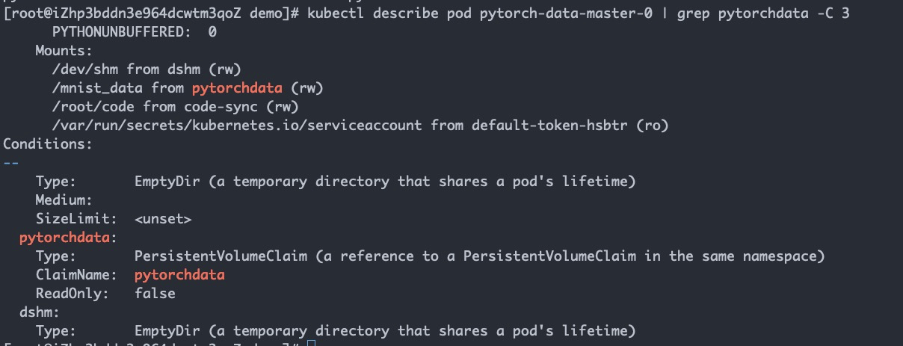

这个示例展示了如何使用 `Arena` 提交一个 pytorch 分布式的作业，挂载一个 NFS 数据卷。该示例将从 git url 下载源代码。

1. 搭建一个 nfs server（详情参考：https://www.cnblogs.com/weifeng1463/p/10037803.html)
	```shell
	# install nfs server
	➜ yum install nfs-utils -y
    # 创建 nfs server 的本地目录
	➜ mkdir -p /root/nfs/data
	# 配置 nfs server
	➜ cat /etc/exports
	/root/nfs/data *(rw,no_root_squash)
	# Start nfs server
	➜ systemctl start nfs;  systemctl start rpcbind
	➜ systemctl enable nfs
	Created symlink from /etc/systemd/system/multi-user.target.wants/nfs-server.service to /usr/lib/systemd/system/nfs-server.service.
	```
2. 在 nfs 的共享目录中，放入训练数据
	```shell
	# 查看 nfs 服务器的挂载目录，172.16.0.200 为 nfs 服务器端的 ip
	➜ showmount -e 172.16.0.200
	Export list for 172.16.0.200:
	/root/nfs/data *
	# 进入共享目录
	➜ cd /root/nfs/data
	# 提前准备好训练数据
	➜ pwd
	/root/nfs/data
	# MNIST -> 就是我们需要用的训练数据
	➜ ll
	总用量 8.0K
	drwxr-xr-x 4  502 games 4.0K 6月  17 16:05 data
	drwxr-xr-x 4 root root  4.0K 6月  23 15:17 MNIST
	```
3. 创建 pv
	```shell
	# 排版可能导致 yaml 缩进有问题
	➜ cat nfs-pv.yaml 
	apiVersion: v1
	kind: PersistentVolume
	metadata:
	  name: pytorchdata
	  labels:
		pytorchdata: nas-mnist
	spec:
	  persistentVolumeReclaimPolicy: Retain
	  capacity:
		storage: 10Gi
	  accessModes:
	  - ReadWriteMany
	  nfs:
		server: 172.16.0.200
		path: "/root/nfs/data"
	
	➜ kubectl create -f nfs-pv.yaml
	persistentvolume/pytorchdata created
	➜ kubectl get pv | grep pytorchdata
	pytorchdata   10Gi       RWX            Retain           Bound    default/pytorchdata                           7m38s
	```
5. 创建 pvc
	```shell
	➜ cat nfs-pvc.yaml
	apiVersion: v1
	kind: PersistentVolumeClaim
	metadata:
	  name: pytorchdata
	  annotations:
		description: "this is the mnist demo"
		owner: Tom
	spec:
	  accessModes:
		- ReadWriteMany
	  resources:
		requests:
		   storage: 5Gi
	  selector:
		matchLabels:
		  pytorchdata: nas-mnist
		  
	➜ kubectl create -f nfs-pvc.yaml
	persistentvolumeclaim/pytorchdata created
	➜ kubectl get pvc | grep pytorchdata
	pytorchdata   Bound    pytorchdata   10Gi       RWX                           2m3s
	```
7. 检查数据卷
	```shell
	➜ arena data list
	NAME         ACCESSMODE     DESCRIPTION             OWNER  AGE
	pytorchdata  ReadWriteMany  this is the mnist demo  Tom    2m
	```
9. 提交 pytorch 作业，通过 `--data pvc_name:container_path` 挂载分布式存储卷	
	```shell
	➜ arena --loglevel info submit pytorch \
            --name=pytorch-data \
            --gpus=1 \
            --workers=2 \
            --image=registry.cn-huhehaote.aliyuncs.com/lumo/pytorch-with-tensorboard:1.5.1-cuda10.1-cudnn7-runtime \
            --sync-mode=git \
            --sync-source=https://code.aliyun.com/370272561/mnist-pytorch.git \
            --data=pytorchdata:/mnist_data \
            "python /root/code/mnist-pytorch/mnist.py --backend gloo --data /mnist_data/data"
	configmap/pytorch-data-pytorchjob created
	configmap/pytorch-data-pytorchjob labeled
	pytorchjob.kubeflow.org/pytorch-data created
	INFO[0000] The Job pytorch-data has been submitted successfully
	INFO[0000] You can run `arena get pytorch-data --type pytorchjob` to check the job status
	```
11. 通过 kubectl describe 查看存储卷 `pytorchdata` 在其中一个 instance 的情况
	```shell
	# 查看作业 pytorch-data 的实例情况
	➜ arena get pytorch-data
	STATUS: SUCCEEDED
	NAMESPACE: default
	PRIORITY: N/A
	TRAINING DURATION: 56s

	NAME          STATUS     TRAINER     AGE  INSTANCE               NODE
	pytorch-data  SUCCEEDED  PYTORCHJOB  1m   pytorch-data-master-0  172.16.0.210
	pytorch-data  SUCCEEDED  PYTORCHJOB  1m   pytorch-data-worker-0  172.16.0.210
	
    # 通过 kubectl describe 查看实例 pytorch-data-master-0 存储卷 pytorchdata 的情况
	➜ kubectl describe pod pytorch-data-master-0 | grep pytorchdata -C 3
	```
	 